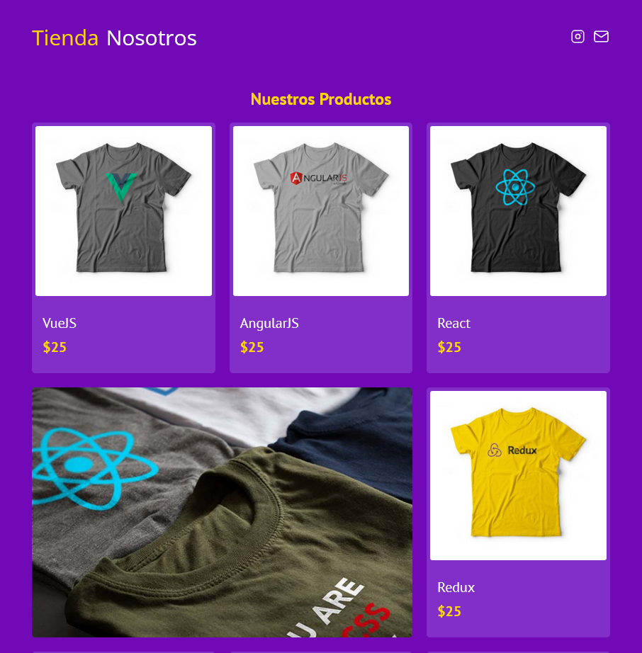

<h1 align="center">frontend-sotre - cgamcs</h1>

At first glance <a href="https://frontend-store-cgamcs.netlify.app/" target="_blank">frontend store</a> is a static page that helped me practice CSS

## ✏️ Things I learned

I learned how to use the grid attribute in addition to visualizing and understanding it in the element inspector, in addition to the fact that depending on the conditions it is necessary or easier to use flexbox and also write responsively with patterns using grid and flexbox. I understood the importance of BEM(block element modifier) that helps us to create reusable and ordered code in CSS projects, in addition to its rules that can basically be divided into 3: blocks, elements and modifiers.

1. Blocks: They are a Container, if a section on its own is significant and does not require other sections for its appearance (CSS) it should go in a block.
2. Elements: Part of a block, it depends on the block and is not significant on its own; They have the characteristic that they use the name of the block and then double underscore(__).
3. Modifiers: Will a Block or Element have a variant? A modifier is used, which is a "flag" that warns that the element will have a different design. 

## 🎨 Color code

| Color       | Hex                                                                |
| ------------|--------------------------------------------------------------------|
| Purple      |  `#7209b7` |
| Purple Dark |  `#822fca` |
| Yellow      |  `#ffd60a` |
| Yellow Dark |  `#ffc300` |
| White       |  `#ffffff` |
| Black       |  `#000000` |